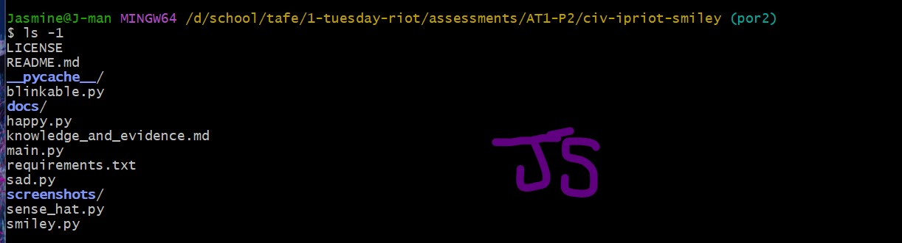

# Evidence and Knowledge

This document includes instructions and knowledge questions that must be completed to receive a *Competent* grade on this portfolio task.

## 1. Required evidence

### 1.1. Answer all questions in this document

- Each answer should be complete, well-articulated, and within the specified word count limits (if added) for each question.
- Please make sure **all** external sources are properly cited.
- You must **use your own words**. Please include your full chat transcripts if you use generative AI in any way.
- Generative AI hallucinates, is not an authoritative source

### 1.2. Make all the required modifications to the code

- Please follow the instructions in this document to make the changes needed to the code.

- When requested to upload evidence, upload all screenshots to `screenshots/` and embed them in this document. For example:

```markdown

```


> Note the `!`, and the use of a relative path.

- You must upload the code into your GitHub repository.
- While you can use a branch, your code should be in main when you submit.
- Upload a zip of this repository to Blackboard when you are ready to submit.
- You will be notified of your result via Blackboard
- However, if using GitHub classrooms, you may also receive additional feedback on GitHub directly

### 1.3. Optional: Use of Raspberry Pi and SenseHat

Raspberry Pi or SenseHat is **optional** for this activity. You can use the included `sense_hat.py` file to simulate the SenseHat on your computer.

If you use a Pi, please **delete** the `sense_hat.py` file.

### 1.4. Accessible version of the code

This project relies on visual patterns that appear on an LED matrix. If you have any accessibility requirements, you can use the `udl/accessible` branch to complete the project. This branch provides an accessible code version that uses text-based patterns instead of visual ones.

Please discuss this with your lecturer before using that branch.

## 2. Specific Tasks & Questions

Address the following tasks and questions based on the code provided in this repository.

### 2.1. Set up the project locally

1. Fork this repository (if not using GitHub Classrooms)
2. Clone your repository locally
3. Run the project locally by executing the `main.py` file
4. Evidence this by providing screenshots of the project directory structure and the output of the `main.py` file




If you are running on a Raspberry Pi, you can use the following command to run the project and then screenshot the result:

```bash
ls
python3 main.py
```

### 2.2. Fundamental code comprehension

 Answer each of the following questions **as they relate to that code** supplied by in this repository (ignore `sense_hat.py`):

1. Examine the code for the `smiley.py` file and provide  an example of a variable of each of the following types and their corresponding values (`_` should be replaced with the appropriate values):

   | Type                    | name           | value                                 |
   | ----------              | -------------- | ------------------------------------- |
   | built-in primitive type | Y              | (255, 255, 0) This is a tuple of ints representing the colour yellow                                                     |
   | built-in composite type | self.pixels    | A list of 63 colour tuples (O, Y)     | 
   | user-defined type       | self.sense_hat |  Instance of SenseHat()               |

2. Fill in (`_`) the following table based on the code in `smiley.py`:

   | Object                   | Type                    |
   | ------------             | ----------------------- |
   | self.pixels              | List                    |
   | A member of self.pixels  | Tuples (RGB colour)     |
   | self                     | Smiley (class instance) |

3. Examine the code for `smiley.py`, `sad.py`, and `happy.py`. Give an example of each of the following control structures using an example from **each** of these files. Include the first line and the line range:

   | Control Flow | File       | First line                        | Line range  |
   | ------------ | ---------- | --------------------------------- | ----------- |
   |  sequence    | `smiley.py`| `self.pixels = [O, Y, Y, ...]`    |    15-23    |
   |  selection   | `happy.py` | `if wide_open:` inside `draw_eyes`|    22-24    |
   |  iteration   | `sad.py`   | `for pixel in mouth`              |    10-12    |

4. Though everything in Python is an object, it is sometimes said to have four "primitive" types. Examining the three files `smiley.py`, `sad.py`, and `happy.py`, identify which of the following types are used in any of these files, and give an example of each (use an example from the code, if applicable, otherwise provide an example of your own):

   | Type                    | Used?   |                    Example                      |
   | ----------------------- | ------- | ----------------------------------------------- |
   | int                     | Yes     | The pixels indexes in loops like the `for pixel in mouth` loop where `mouth = [41, 46, 50, 51, 52, 53] `                              |
   | float                   | Yes     | `delay=-0.25` in `blink(self, delay=0.25)`      |
   | str                     | Yes     | `wide_open` as a parameter name                 |
   | bool                    | Yes     | `wide_open=True` in `draw_eyes(self, wide_open=True)`                                                                      |

5. Examining `smiley.py`, provide an example of a class variable and an instance variable (attribute). Explain **why** one is defined as a class variable and the other as an instance variable.

> In `smiley.py` a class variable would be `YELLOW = (255, 255, 0)`. This is because class variables are defined at the class level and shared across the class. That means that the value of `YELLOW` will be the same throughout every smiley object.  

> A instance variable in `smiley.py` is anything inside the `__init__` method using `self.`. Example of this would be `self.pixels = [0, Y, Y, Y, ...]`. Each smiley object has its own copy of `self.pixels` so the pixelation can change depending on the instance. 

6. Examine `happy.py`, and identify the constructor (initializer) for the `Happy` class:
   1. What is the purpose of a constructor (in general) and this one (in particular)?

   > The constructor in the Happy class is in the `__init__` method. In general, constructors initialise a new object when it is created and prepares the object for use. In particular with the Happy class the constructor first calls `super().__init__()`, then `self.draw_mouth()`, then `self.draw_eyes()`

   2. What statement(s) does it execute (consider the `super` call), and what is the result?

   > It executes `super().__init__()` to run the Smiley constuctor which sets up the LED pixel grid and the SenseHat object. It then runs `self.draw_mouth()` which creates a smiling mouth and then it runs`self.draw_eyes()` which give it pixels for the open eyes. 

   > The result is a fully initialised happy smiley face that is ready to be displayed on the SenseHat/mock LED grid. 

### 2.3. Code style

1. What code style is used in the code? Is it likely to be the same as the code style used in the SenseHat? Give to reasons as to why/why not:

> The coding style follows Pythons style guide, PEP 8. It doens't necessarily have to be the same as the SenseHat internal style because the library was written by different developers and put hardware efficiency over readibility standards. 

> PEP 8 is used to keep code readible and clear while SenseHat library code piroritises performace over clear code. 

2. List three aspects of this convention you see applied in the code.

> PEP 8 can be seen used when the variables are named. `draw_eyes`, `dim_display` are both examples of snake_case which is a PEP 8 styling rule. 

>The correct amount of indents and spacing is used throughtout the code (4 spaces for an indent)

> Also, the use of docstrings and comments to explain the codes purpose and methods is a part of PEP 8. 

3. Give two examples of organizational documentation in the code.

> One is the use of docstrings at the start of classes and methods to describe the function/purpose. In the Happy class, `"""Renders a mouth by blanking the pixels that form that object."""` is the docstring used to describe the `draw_mouth` function. 
> Two is the use of inline comments to clarify logic such as, `# We have encapsulated the SenseHat object` in the Smiley class. 

### 2.4. Identifying and understanding classes

> Note: Ignore the `sense_hat.py` file when answering the questions below

1. List all the classes you identified in the project. Indicate which classes are base classes and which are subclasses. For subclasses, identify all direct base classes.
  
  Use the following table for your answers:

| Class Name | Super or Sub? | Direct parent(s)  |
| ---------- | ------------- | ----------------- |
| Smiley     | Suepr         | None              |
| Happy      | Sub           | Smiley, Blinkable |
| Sad        | Sub           | Smiley            |
| Blinkable  | Super         | None              |

2. Explain the concept of abstraction, giving an example from the project (note "implementing an ABC" is **not** in itself an example of abstraction). (Max 150 words)

> Abstaction is the concept of hiding complex details and showing obly essential features of the code. It lets you use objects without needing to know how they work internally. it makes code cleaner and easier to read with less chance of errors. 

> In this porject the Smiley class hides the messy details about how the SenseHat displays pixels. The user just class a method like `show()` or `dim_display()` wihtout needing to directly deal with the LED controls. 

3. What is the name of the process of deriving from base classes? What is its purpose in this project? (Max 150 words)

> The process of deriving from base classes is called inheritence. 

> In this Smiley project, inheritence allows classes like Happy and Sad to reuse code from the Smiley class. Instead of needing to rewrite code to draw the pixels or interact with SenseHat, the subclasses inherit that fuctionality and modify the parts to make their expressions. It helps heep the project modular and easy to maintain. 

### 2.5. Compare and contrast classes

Compare and contrast the classes Happy and Sad.

1. What is the key difference between the two classes?
   > The key difference is their unique facial expressions. The Happy class draws a smiling mouth with open eyes, while the Sad class draws a frowning mouth with the eyes the same. 

2. What are the key similarities?
   > Both inherit from the Smiley class and use the base structure, methods and colours. Each uses `draw_mouth` and `draw_eyes` albeit differently but the overall layout and logic is the same. 

3. What difference stands out the most to you and why?
   > The most noticable difference betwen Happy and Sad is the mouth expression. Pixel adjustments flips the face from cheerful to sad. Showing the visual change in the facial expression. 
   
4. How does this difference affect the functionality of these classes
   > It changes the ouput appearance on the LED gris while keeping the same underlying logic. Both classes still perform the task of showing a face but the moods differ. This allows for a flexable display without changing the core system. 

### 2.6. Where is the Sense(Hat) in the code?

1. Which class(es) utilize the functionality of the SenseHat?
   > The Smiley, Happy, and Sad classes all utilise the SenseHat's functionalilty but only the Smiley class directly creat and manages the SenseHat objects. 
   
2. Which of these classes directly interact with the SenseHat functionalities?
   > The Smiley class directly interacts with the SenseHat. It uses the SenseHat object and uses its methods like `set_pixels()` and `low_light`. The subclasses Happy and Sad, inherit these methods rather than calling SenseHat themselves. 

3. Discuss the hiding of the SenseHAT in terms of encapsulation (100-200 Words)
   > The SenseHat object is encapsulated within the Smiley class to haide the internal logic from other parts of the code. By assigning SenseHat to `self.sense_hat` inside the constructor, only Smiley controls  how the hardware is used. Other classes such as Happy and Sad don't interact with SenseHat directly. They call `show()` or modify `pixels` letting Smiley handle the actual display logic. 

   > The approach follows the principle of encapsulation, which protects the internal logic/layout of an object and only shows what is necessary. If the SenseHat hardware was to chnage the updates would only need to occur inside Smiley and wouldn't affect the subclasses. 
   

### 2.7. Sad Smileys Can’t Blink (Or Can They?)

Unlike the `Happy` smiley, the current implementation of the `Sad` smiley does not possess the ability to blink. Let's first explore how blinking has been implemented in the Happy Smiley by examining the blink() method, which takes one argument that determines the duration of the blink.

**Understanding Blink Mechanism:**

1. Does the code's author believe that every `Smiley` should be able to blink? Explain.

   > No, the author doesn't believe every Smiley shoudl blink becuase only the Happy class include the `blink()` method from the Blinkable class. This shows that blinkning is an optional behaviour, not something every Smiley has to have. 


2. For those smileys that blink, does the author expect them to blink in the same way? Explain.

   > Yes, since the blinking ability is inherited from the same Blinkable class and they all use the same `blink()` logic. This means the author would expect any class that can bliunk to follow the same blink behaviour. 


3. Referring to the implementation of blink in the Happy and Sad Smiley classes, give a brief explanation of what polymorphism is.

   > Polymorphism is when different classes can use the same method in different ways for different objects. In this project, if Sad also inpletmented `blink()`, both Happy and Sad could call `smiley.blink()` but each could behave differenly like one cheerful and one gloomy. 


4. How is inheritance used in the blink method, and why is it important for polymorphism?

   > Inheritence allows the Happy class to gain structure and behaviour from both Smiley and Blinkable. Because of this, happy can use or override methods like `blink()` without rewriting the code from scratch. This is important for polymorphism because it lets different classes respond to the same command in different ways. 

1. **Implement Blink in Sad Class:**

   - Create a new method called `blink` within the Sad class. Ensure you use the same method signature as in the Happy class:

   ```python
   def blink(self, delay=0.25):
       pass  # Replace 'pass' with your implementation
   ```

2. **Code Implementation:** Implement the code that allows the Sad smiley to blink. Use the implementation from the Happy Smiley as a reference. Ensure your new method functions similarly by controlling the blink duration through the `delay` argument.

3. **Testing the Implementation:**

- Test the new blink functionality on your Raspberry Pi or within the Python classes provided. You might need to adjust the `main.py` script to incorporate Sad Smiley's new blinking capability.

Include a screenshot of the sad smiley or the modified `main.py`:


- Observe and document the Sad smiley as it blinks its eyes. Describe any adjustments or issues encountered during implementation.

  > When testing the `sad_smiley`'s blink, the eyes alternated between open and closed correctly within the duration controlled by the `delay` parameter. The implementation mirrored the Happy smiley's blink show inheritence. No issues were encounted in the code but I did adjust the main code to have `from sad import Sad` and the Sad to have `from blinkable import Blinkable` (though not really needed) and `import time`.

  ### 2.8. If It Walks Like a Duck…

  Previously, you implemented the blink functionality for the Sad smiley without utilizing the class `Blinkable`. Assuming you did not use `Blinkable` (even if you actually did), consider how the Sad smiley could blink similarly to the Happy smiley without this specific class.

  1. **Class Type Analysis:** What kind of class is `Blinkable`? Inspect its superclass for clues about its classification.

     > Blinkable is an abstract base class (ABC). It's superclass is ABC from Python's abc module, which is used to define absract classes that can't be implemented directly. In this project Blinkable requires any blinkable class like Happ or Sad to have its own `blink()` method to ensure all blinkable smileys work the same. 

  2. **Class Implementation:** `Blinkable` is a class intended to be implemented by other classes. What generic term describes this kind of class, which is designed for implementation by others? **Clue**: Notice the lack of any concrete implementation and the naming convention.
      > Blinkable is an abstract class/interface-like class because it is meant to be inplemented by other classes and does not provide a full implementation itself. 

  3. **OO Principle Identification:** Regarding your answer to question (2), which Object-Oriented (OO) principle does this represent? Choose from the following and justify your answer in 1-2 sentences: Abstraction, Polymorphism, Inheritance, Encapsulation.

      > This represents abstraction. The classs defines what blinkable objects should do without specifying how it should do it. THis allows other classes to provide the implementation. 

  4. **Implementation Flexibility:** Explain why you could grant the Sad Smiley a blinking feature similar to the Happy Smiley's implementation, even without directly using `Blinkable`.

      > You could give the Sad smiley a blinking feature without using the Blinkable class because Python allows any class to define a method at runtime as long as it match the expected behaviour. The means I could have implmented `blink()` directly in Sad and it will work just like Happy's.

  5. **Concept and Language Specificity:** In relation to your response to question (4), what is this capability known as, and why is it feasible in Python and many other dynamically typed languages but not in most statically typed programming languages like C#? **Clue** This concept is hinted at in the title of this section.

       > This capability to known as duck typing 🦆. In Python, which is a dynamically typed language, an object can be used if it has the right methods even if it doesn't formally inherit from a class. In languages like C#, a class must explicity inherit from an interface or base class to be allowed to use its methods. 

  ***

  ## 3. Refactoring

  ### 3.1. Does a Smiley Have to Be Yellow?

  While our current implementation predominantly features yellow smileys, emotional expressions like sickness or anger typically utilize colors like green, red, or orange. We'll explore the feasibility of integrating these colors into our smileys.

  1. **Defined Colors and Their Location:**

     1. Which colors are defined and in which class(s)?
        > There are three colours defined in the Smiley class. WHITE, GREEN, RED, YELLOW, and BLANK

     2. What type of variables hold these colors? Are the values expected to change during the program's execution? Explain your answer.
        > The colours are stored as tuples representing the RGB values. Since they are a class variable their values, hardcoded and are shared across all smiley objects I would say they are not meant to change during execution. 

     3. Add the color blue to the appropriate class using the appropriate format and values.

  2. **Usage of Color Variables:**

     1. In which classes are the color variables used?
        > The colour variables are used in the Eyes, Mouth and Head classes to set each part of the face to the colour. 

  3. **Simple Method to Change Colors:**
  4. What is the easiest way you can think to change the smileys to green? Easiest, not necessarily the best!
     > The easiest (and wrongest) way to change the faces to green would be to change Yellow's tuple to (0, 255, 0).

  ### 3.2. Flexible Colors – Step 1

  Changing the color of the smileys once is straightforward, but it isn't very flexible. To facilitate various colors for smileys, it is advisable not to hardcode values in any class. This approach was identified earlier as a necessary change. Let's start by removing the built-in assumptions about color in our classes.

  1. **Add a method called `complexion` to the `Smiley` class:** Implement this instance method to return `self.YELLOW`. Using the term "complexion" instead of "color" provides a more abstract terminology that focuses on the meaning rather than implementation.

  2. **Refactor subclasses to use the `complexion` method:** Modify any subclass that directly accesses the color variable to instead utilize the new `complexion` method. This ensures that color handling is centralized and can be easily modified in the future.

  3. **Determine the applicable Object-Oriented principle:** Consider whether Abstraction, Polymorphism, Inheritance, or Encapsulation best applies to the modifications made in this step.

  4. **Verify the implementation:** Ensure that the modifications function as expected. The smileys should still display in yellow, confirming that the new method correctly replaces the direct color references.

  This step is crucial for setting up a more flexible system for color management in the smiley display logic, allowing for easy adjustments and extensions in the future.

  ### 3.3. Flexible Colors – Step 2

  Having removed the hardcoded color values, we now enhance the base class to support dynamic color assignments more effectively.

  1. **Modify the `__init__()` method in the `Smiley` class:** Introduce a default argument named `complexion` and assign `YELLOW` as its default value. This allows the instantiation of smileys with customizable colors.

  2. **Introduce a new instance variable:** Create a variable called `my_complexion` and assign the `complexion` parameter to it. This step ensures that each smiley instance can maintain its own color state.

  3. **Rationale for `my_complexion`:** Using a distinct instance variable like `my_complexion` avoids potential conflicts with the method parameter names and clarifies that it is an attribute specific to the object.

  4. **Bulk rename:** We want to update our grid to use the value of complexion, but we have so many `Y`'s in the grid. Use your IDE's refactoring tool to rename all instances of the **symbol** `Y` to `X`. Where `X` is the value of the `complexion` variable. Include a screenshot evidencing you have found the correct refactor tool and the changes made.

  

  5. **Update the `complexion` method:** Adjust this method to return `self.my_complexion`, ensuring that whatever color is assigned during instantiation is what the smiley displays.

  6. **Verification:** Run the updated code to confirm that Smileys still defaults to yellow unless specified otherwise.

  ### 3.4. Flexible Colors – Step 3

  With the foundational changes in place, it's now possible to implement varied smiley colors for different emotional expressions.

  1. **Adjust the `Sad` class initialization:** In the `Sad` class's initializer method, change the superclass call to include the `complexion` argument with the value `self.BLUE`, as shown:

     ```python
     super().__init__(complexion=self.BLUE)
     ```

  2. **Test color functionality for the Sad smiley:** Execute the program to verify that the Sad smiley now appears blue.

  3. **Ensure the Happy smiley remains yellow:** Confirm that changes to the Sad smiley do not affect the default color of the Happy smiley, which should still display in yellow.

  4. **Design and Implement An Angry Smiley:** Create an Angry smiley class that inherits from the `Smiley` class. Set the color of the Angry smiley to red by passing `self.RED` as the `complexion` argument in the superclass call.

  ***
